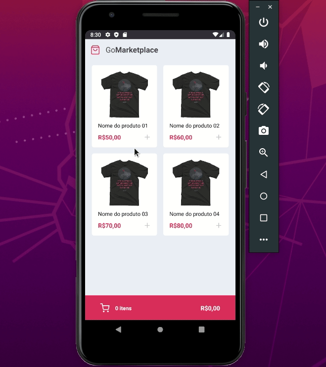

<h1 align="center">
  
</h1>

<h1 align="center">
  
</h1>


## 📝 Description

This mobile app called **GoMarketplace**, which has been developed in **Rocketseat School's Bootcamp GStack**, aims to list products with their names and prices, and increase and decrease the products' quantity while it shows the sum or subtraction of the products' number and price in the cart.

---

## 💻 Used Technologies

- [React Native](https://reactnative.dev/)
- [TypeScript](https://www.typescriptlang.org/)
- [AsyncStorage](https://reactnative.dev/docs/asyncstorage)
- [Context API](https://pt-br.reactjs.org/docs/context.html)

---

## 📁 Download

```bash
# Clone the repository
$ git clone https://github.com/jose-renato-m/08_RN_Fundamentals.git

#Enter into the directory
$ cd 08_RN_Fundamentals

# Install dependencies
$ yarn

# Start fake API
$ yarn json-server server.json -p 3333

# Start bundle
$ yarn start

# Start the app
$ yarn android or yarn ios
```
Obs.: you may choose if you will use a physical device or any of the available emulator applicatives

---

Made with 💙 by José Renato Montagnana
